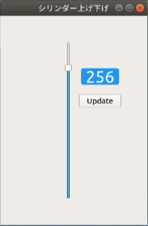

# このパッケージの用途
created by ©︎niscode

ここではTeleco-V（台車）を使って、
- gmappingを用いたSLAM や、
- dwa（障害物回避）と自己位置推定（amcl）を用いたナビゲーション などを実行するためのlaunchファイルが格納されます。
 

## [1/3] Ubuntu20.04 / ROS-noetic　環境を構築するための手順
- `git clone git@github.com:niscode/scripts.git`
- 上記のリポジトリをホームディレクトリに配置後、$ ./ros-noetic-setup.sh を実行。
- 手順通りに進めると　$ roscore できるようになります。
 

## [2/3] Ubuntu20.04 / ROS-noetic　環境で動作に必要なパッケージ群は以下の通りです。
- `sudo apt -y install ros-noetic-rosserial`
- `sudo apt -y install ros-noetic-slam-gmapping`
- `sudo apt -y install ros-noetic-navigation`
 

- `cd catkin_ws/src`
- `git clone https://github.com/niscode/telecoV.git`
- `git clone https://github.com/Slamtec/rplidar_ros.git`
- `git clone https://github.com/iralabdisco/ira_laser_tools.git`
 

- `cd catkin_ws`
- `catkin_make`
 

## [3/3] USB接続されたデバイスファイル名の固定するための手順 （melodic/noetic共通）
- `roscd telecoV/scripts`
- `nano rplidar.rules`
- 上記ファイルを編集して、対応するRPLiDARや台車のボードのシリアルNoを指定します。
- `./create_udev_rules.sh`
- `sudo reboot`
 

### gmappingによる地図作成は以下のように実行します。
- `roslaunch telecoV dual_gmapping.launch`
### navigationによる自律移動は以下のように実行します。
- `roslaunch telecoV dual_naivation.launch`

### cylinderを上下に昇降させるためのスライダを表示するは以下を実行します。
- `rosrun telecoV cylinder.py`
 
- スライダーを上下に動かし、任意の位置で Update ボタンを押すことで動作します。
- ※ `rosrun rosserial_python serial_node.py _port:=/dev/ROVER_BOARD _baud:=115200` が実行中か、
    navigationなどのパッケージ実行中のみ、昇降が可能です。